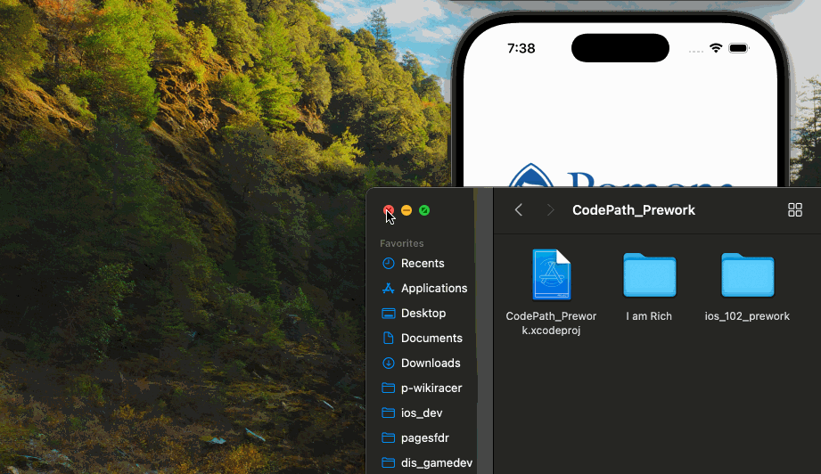

## IOS 102 Prework

### App Description

This application is intended to be used for my IOS 102 Prework. The app extends the ability to make a proper introduction.

### App Walk-though

`TODO://` Add the URL to your animated app walk-though `gif` in the image tag below. Make sure the gif actually renders and animates when viewing this README. (☝️ Remove this paragraph after after adding gif). LICEcap is a great tool for recording and you can simply upload the gif to GitHub and provide the path name in place of URL as shown below.

<!--   OR

  -->

Loom Link if needed: https://www.loom.com/share/ff77764e1255417ba8087281b18cd5e4?sid=d6a1cad2-6235-49eb-9ec8-1ab80ea8d800

### Required Features

- [X] 1. App displays an image of a school's logo
- [X] 2. App has three textfields for first, last, and school names
- [X] 3. App has a segmented control that changes student year
- [X] 4. Number of pet matches label is increased/decreased by stepper
- [X] 5. Switch makes a statement about wanting more pets or not(true/false) 
- [X] 6. Introduce yourself button shows alert box with an introduciton and dismiss button

### Optional Features

- [ ] 1. User can tap a button to change the color of the background view
- [ ] 3. User can select on additional buttons that provide more info about the user. Example: more textfields, a different alert box, etc.
- [ ] 4. Any stylistic changes that are not default options (Comment this here)

